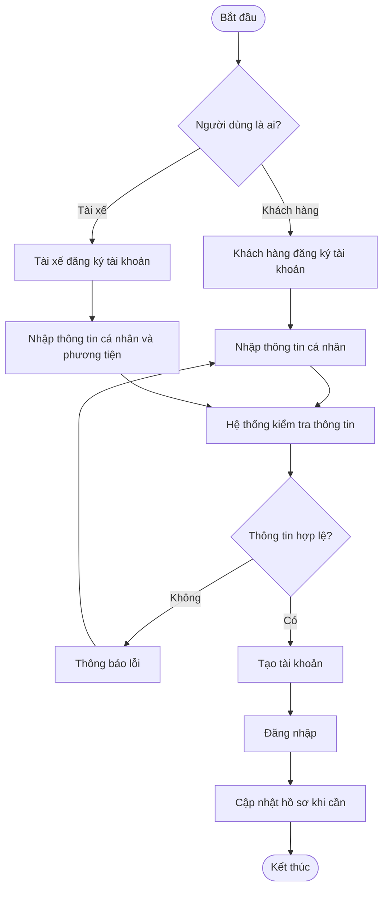
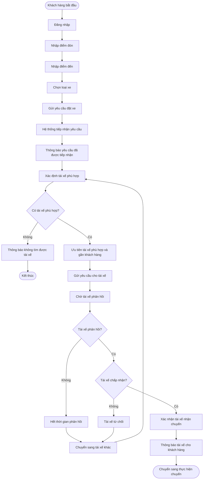
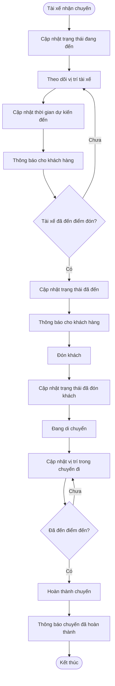
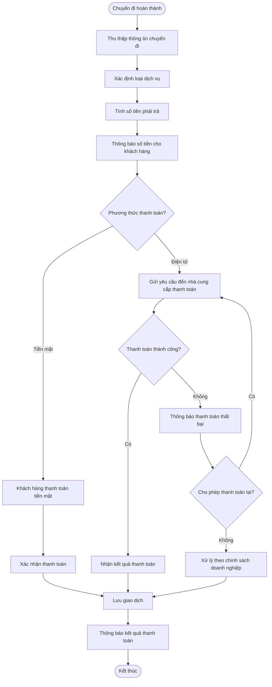
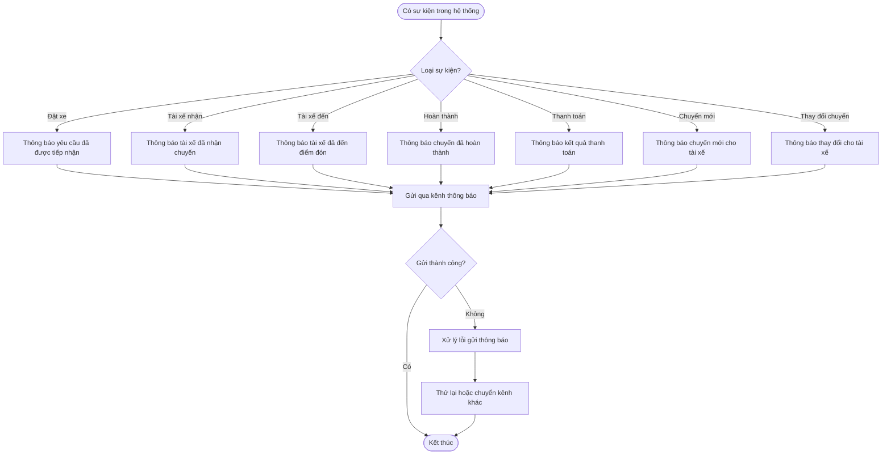
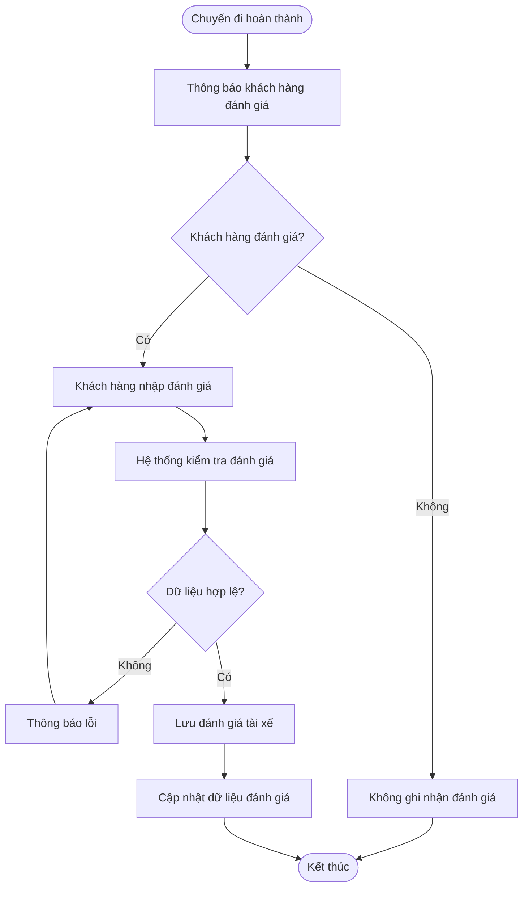
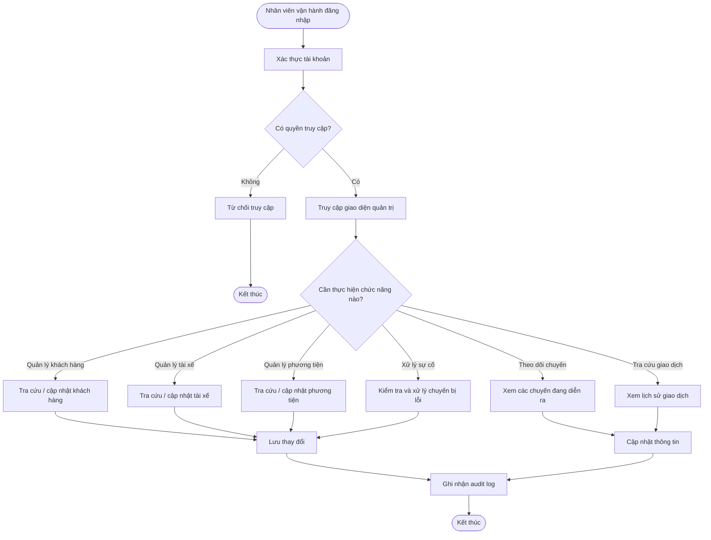
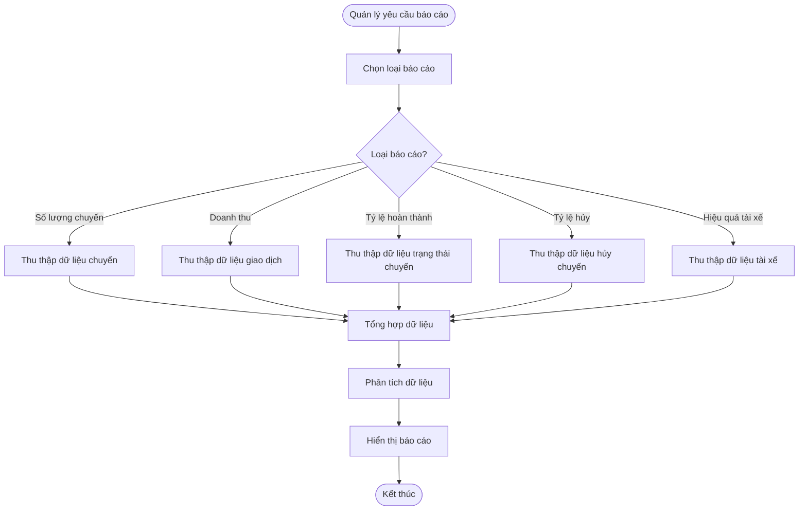
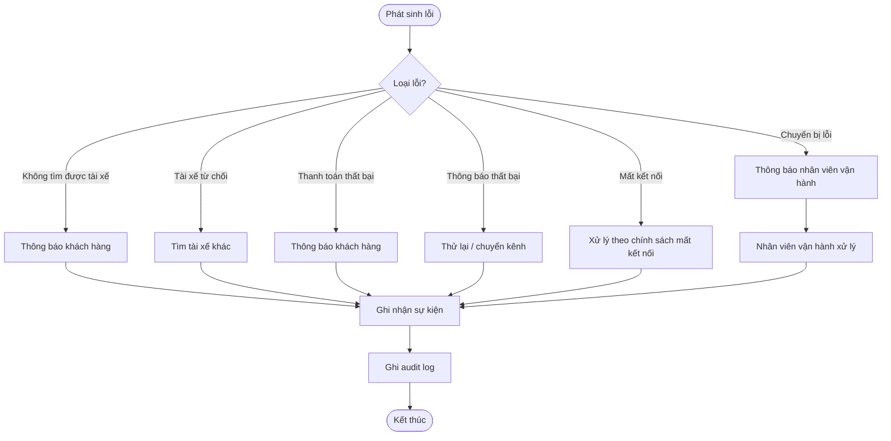
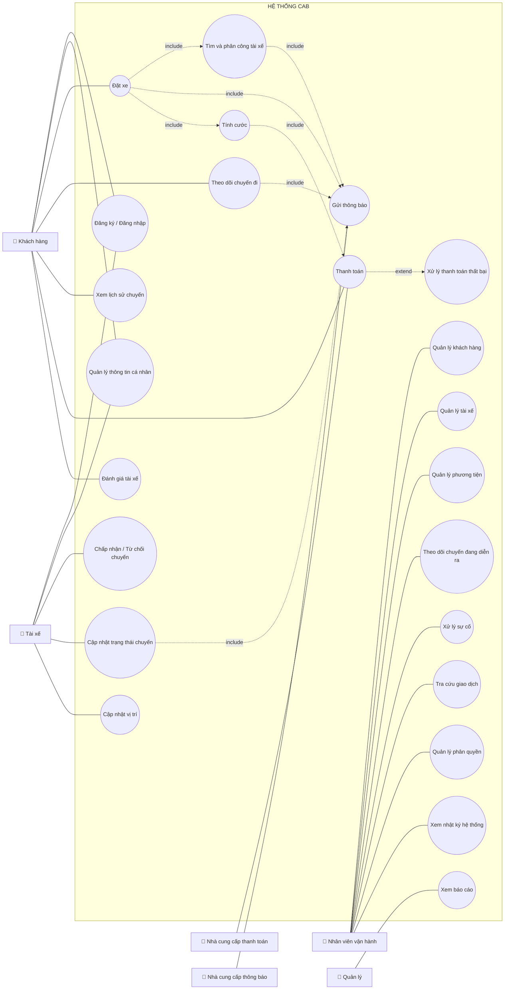

Bước 1: Xác định ngữ cảnh nghiệp vụ và Bussiness Problem

1. Ngữ cảnh nghiệp vụ

Công ty ABC là doanh nghiệp cung cấp dịch vụ đặt xe trực tuyến. Khách hàng có thể đặt xe thông qua tổng đài hoặc ứng dụng, trong khi tài xế thực hiện chuyến và nhân viên vận hành quản lý hoạt động. Tuy nhiên, quy trình hiện tại còn phụ thuộc nhiều vào thao tác thủ công và các thông tin chưa được quản lý tập trung.

Doanh nghiệp muốn xây dựng một nền tảng CAB mới để quản lý xuyên suốt quy trình từ đặt xe → tìm tài xế → thực hiện chuyến → tính cước → thanh toán → đánh giá, đồng thời có khả năng phục vụ số lượng lớn người dùng và mở rộng trong tương lai.

2. Bussiness Problem
Công ty ABC đang gặp khó khăn trong việc quản lý và mở rộng hoạt động đặt xe do quy trình phân công tài xế còn thủ công, thông tin chuyến đi và thanh toán chưa được quản lý tập trung, khả năng theo dõi của khách hàng còn hạn chế và hệ thống hiện tại khó đáp ứng khi quy mô tăng. Điều này làm giảm hiệu quả vận hành, ảnh hưởng đến trải nghiệm khách hàng và hạn chế khả năng phát triển các dịch vụ mới.

Bước 2:

| **Stakeholder**                    | **Vai trò / Mối quan tâm**                                                                                                                                             |
| ---------------------------------- | ---------------------------------------------------------------------------------------------------------------------------------------------------------------------- |
| **Khách hàng**                     | Đăng ký, đặt xe, theo dõi chuyến đi, thanh toán và đánh giá tài xế; quan tâm đến tốc độ, tính chính xác, minh bạch và trải nghiệm sử dụng.                             |
| **Tài xế**                         | Nhận và thực hiện chuyến, cập nhật trạng thái, thông tin phương tiện và vị trí; quan tâm đến việc nhận chuyến phù hợp, thông tin chính xác và thuận tiện khi làm việc. |
| **Nhân viên vận hành**             | Quản lý khách hàng, tài xế, phương tiện và chuyến đi; theo dõi chuyến đang diễn ra và xử lý các trường hợp lỗi; quan tâm đến khả năng kiểm soát và xử lý nhanh.        |
| **Quản lý / Ban giám đốc**         | Theo dõi hiệu quả hoạt động, doanh thu, số lượng chuyến, tỷ lệ hoàn thành/hủy; quan tâm đến hiệu quả kinh doanh, khả năng mở rộng và phát triển hệ thống.              |
| **Bộ phận tài chính / kế toán**    | Theo dõi doanh thu, giao dịch và đối soát thanh toán; quan tâm đến tính chính xác, đầy đủ và an toàn của dữ liệu giao dịch.                                            |
| **Nhà cung cấp thanh toán**        | Xử lý các giao dịch thanh toán điện tử; quan tâm đến tính chính xác, bảo mật và khả năng tích hợp ổn định với hệ thống CAB.                                            |
| **Nhà cung cấp dịch vụ thông báo** | Cung cấp các kênh gửi thông báo cho khách hàng và tài xế; quan tâm đến khả năng gửi thông báo chính xác, ổn định và có thể mở rộng thêm kênh.                          |
| **Business Analyst**               | Thu thập, phân tích và làm rõ nhu cầu của các bên liên quan; quan tâm đến việc xác định đúng phạm vi, yêu cầu, quy tắc nghiệp vụ và các vấn đề còn chưa rõ.            |
| **Đội phát triển / IT**            | Phân tích, xây dựng và triển khai hệ thống; quan tâm đến yêu cầu rõ ràng, khả năng mở rộng, tích hợp và bảo trì hệ thống.                                              |

Ma trận stakeholder:

                         MỨC ĐỘ QUAN TÂM
                  THẤP                     CAO
              ┌─────────────────────┬─────────────────────┐
        CAO   │                     │  MANAGE CLOSELY     │
              │  KEEP SATISFIED     │                     │
QUYỀN         │ • Nhà cung cấp      │ • Ban giám đốc      │
LỰC           │   thanh toán        │ • Nhân viên vận hành│
              │ • Nhà cung cấp      │                     │
              │   thông báo         │                     │
              ├─────────────────────┼─────────────────────┤
        THẤP  │                     │  KEEP INFORMED      │
              │  MONITOR            │                     │
              │ • Tài chính/kế toán │ • Khách hàng        │
              │ • Đội IT/Phát triển │ • Tài xế            │
              │                     │ • Business Analyst  │
              └─────────────────────┴─────────────────────┘

Bước 3:
Bussiness Goal của khách hàng:

Business Goals

| **Business Goal**                                          | **Mục đích**                                                                                                                                                                                                 |
| ---------------------------------------------------------- | ------------------------------------------------------------------------------------------------------------------------------------------------------------------------------------------------------------ |
| **BG001: Hỗ trợ đặt xe trực tuyến**                        | Cho phép khách hàng tạo yêu cầu đặt xe nhanh chóng, thuận tiện và quản lý toàn bộ quá trình đặt xe trên một nền tảng tập trung.                                                                              |
| **BG002: Tự động hóa việc tìm và phân công tài xế**        | Tự động xác định và lựa chọn tài xế phù hợp dựa trên vị trí, trạng thái sẵn sàng và các tiêu chí vận hành; tiếp tục tìm tài xế khác nếu tài xế được đề xuất từ chối hoặc không phản hồi.                     |
| **BG003: Hỗ trợ theo dõi chuyến đi**                       | Cho phép khách hàng và nhân viên vận hành theo dõi trạng thái chuyến đi, thông tin tài xế và thời gian dự kiến tài xế đến.                                                                                   |
| **BG004: Hỗ trợ quản lý và thực hiện chuyến đi**           | Cho phép tài xế nhận chuyến, cập nhật các trạng thái trong quá trình thực hiện và ghi nhận thông tin vị trí để hỗ trợ vận hành.                                                                              |
| **BG005: Hỗ trợ tính cước và thanh toán**                  | Tính toán số tiền khách hàng phải trả dựa trên loại dịch vụ và thông tin chuyến đi; hỗ trợ thanh toán tiền mặt và thanh toán điện tử thông qua nhà cung cấp bên ngoài.                                       |
| **BG006: Quản lý thông báo tập trung**                     | Đảm bảo khách hàng và tài xế nhận được thông báo kịp thời về các sự kiện quan trọng của chuyến đi, đồng thời cho phép mở rộng thêm các kênh thông báo trong tương lai.                                       |
| **BG007: Hỗ trợ quản lý vận hành**                         | Cung cấp cho nhân viên vận hành khả năng quản lý khách hàng, tài xế, phương tiện, chuyến đi và xử lý các trường hợp bất thường.                                                                              |
| **BG008: Hỗ trợ báo cáo và quản lý hiệu quả kinh doanh**   | Cung cấp dữ liệu về số lượng chuyến, doanh thu, tỷ lệ hoàn thành, tỷ lệ hủy và hiệu quả hoạt động của tài xế để hỗ trợ quản lý và ra quyết định.                                                             |
| **BG009: Đảm bảo an toàn và bảo mật thông tin**            | Bảo vệ thông tin cá nhân, dữ liệu vị trí, dữ liệu giao dịch và kiểm soát quyền truy cập đối với các chức năng nhạy cảm.                                                                                      |
| **BG010: Đảm bảo khả năng mở rộng và phát triển hệ thống** | Xây dựng nền tảng có thể phục vụ số lượng lớn khách hàng và tài xế, cho phép mở rộng độc lập các thành phần và bổ sung dịch vụ, phương thức thanh toán hoặc nhà cung cấp mới trong tương lai.                |
| **BG011: Đảm bảo tính ổn định và liên tục của hệ thống**   | Hạn chế việc lỗi ở một chức năng như thanh toán hoặc thông báo ảnh hưởng đến toàn bộ hệ thống đặt xe, đồng thời cho phép triển khai các chức năng mới từng phần mà ít ảnh hưởng đến hệ thống đang hoạt động. |

Bước 4: 
Xác định phạm vi

1. In Scope – Trong phạm vi

| **Nhóm**                | **Phạm vi hệ thống CAB**                                                                                                                      |
| ----------------------- | --------------------------------------------------------------------------------------------------------------------------------------------- |
| **Quản lý tài khoản**   | Đăng ký, đăng nhập, cập nhật thông tin khách hàng và tài xế; xác thực người dùng.                                                             |
| **Đặt xe**              | Nhập điểm đón, điểm đến, lựa chọn loại xe, tạo và tiếp nhận yêu cầu đặt xe.                                                                   |
| **Tìm tài xế**          | Xác định tài xế phù hợp dựa trên vị trí, trạng thái sẵn sàng và tiêu chí vận hành; tự động tìm tài xế khác khi tài xế từ chối/không phản hồi. |
| **Quản lý tài xế**      | Quản lý hồ sơ, phương tiện, trạng thái hoạt động và khả năng nhận chuyến của tài xế.                                                          |
| **Quản lý chuyến đi**   | Nhận chuyến, cập nhật trạng thái: đã đến điểm đón → đã đón khách → đang di chuyển → hoàn thành; lưu thông tin chuyến đi.                      |
| **Theo dõi vị trí**     | Ghi nhận vị trí tài xế để hỗ trợ tìm tài xế gần khách và dự kiến thời gian đến.                                                               |
| **Theo dõi chuyến**     | Khách hàng theo dõi trạng thái yêu cầu/chuyến đi, tài xế và thời gian dự kiến đến.                                                            |
| **Tính cước**           | Xác định số tiền phải trả dựa trên loại dịch vụ và thông tin chuyến đi.                                                                       |
| **Thanh toán**          | Hỗ trợ tiền mặt và thanh toán điện tử; tích hợp nhà cung cấp thanh toán bên ngoài; xử lý giao dịch thất bại.                                  |
| **Thông báo**           | Thông báo cho khách hàng/tài xế về yêu cầu đặt xe, nhận chuyến, tài xế đến, hoàn thành chuyến và kết quả thanh toán.                          |
| **Đánh giá**            | Cho phép khách hàng đánh giá tài xế sau khi hoàn thành chuyến.                                                                                |
| **Quản trị vận hành**   | Nhân viên quản lý khách hàng, tài xế, phương tiện, chuyến đi, trạng thái tài xế và các trường hợp lỗi.                                        |
| **Phân quyền**          | Kiểm soát quyền truy cập các chức năng quản trị và thao tác nhạy cảm.                                                                         |
| **Lịch sử & giao dịch** | Tra cứu lịch sử chuyến đi và lịch sử giao dịch.                                                                                               |
| **Báo cáo**             | Báo cáo số lượng chuyến, doanh thu, tỷ lệ hoàn thành, tỷ lệ hủy và hiệu quả hoạt động tài xế.                                                 |
| **Bảo mật & Audit**     | Bảo vệ dữ liệu cá nhân, vị trí, giao dịch và lưu vết các thao tác quan trọng.                                                                 |
| **Khả năng mở rộng**    | Thiết kế nền tảng cho phép mở rộng số lượng người dùng và bổ sung dịch vụ, phương thức thanh toán, kênh thông báo mới.                        |

2. Out of Scope / Chưa xác định – Ngoài hoặc chưa thuộc phạm vi hiện tại

   
| **Nội dung**                                        | **Trạng thái**                                                                            |
| --------------------------------------------------- | ----------------------------------------------------------------------------------------- |
| **Chi tiết công thức tính cước**                    | Chưa xác định, cần BA làm rõ với khách hàng.                                              |
| **Tiêu chí và thuật toán ưu tiên tài xế**           | Chưa chốt, cần xác nhận với doanh nghiệp.                                                 |
| **Thời gian tài xế phải phản hồi**                  | Chưa xác định.                                                                            |
| **Chính sách hủy chuyến**                           | Chưa xác định.                                                                            |
| **Cách xử lý khi mất kết nối mạng**                 | Chưa xác định.                                                                            |
| **Thời gian lưu trữ dữ liệu**                       | Chưa xác định.                                                                            |
| **Thông tin nhạy cảm của thẻ/tài khoản thanh toán** | **Không lưu trực tiếp trên CAB**; do nhà cung cấp thanh toán bên ngoài xử lý.             |
| **Hệ thống của nhà cung cấp thanh toán**            | CAB chỉ tích hợp và nhận kết quả giao dịch, không xây dựng hệ thống thanh toán bên ngoài. |
| **Hệ thống cung cấp dịch vụ thông báo bên ngoài**   | CAB tích hợp với nhà cung cấp nhưng không xây dựng hạ tầng của nhà cung cấp.              |

Bước 5:Xác định Bussiness Requirement:

| **Business Requirement**                    | **Diễn giải**                                                                                                                                                                                     |
| ------------------------------------------- | ------------------------------------------------------------------------------------------------------------------------------------------------------------------------------------------------- |
| **BR01: Đặt xe trực tuyến**                 | Hệ thống phải hỗ trợ khách hàng tạo yêu cầu đặt xe bằng cách nhập điểm đón, điểm đến và lựa chọn loại xe phù hợp.                                                                                 |
| **BR02: Tìm và phân công tài xế**           | Hệ thống phải tự động tìm và phân công tài xế phù hợp dựa trên vị trí, trạng thái sẵn sàng và các tiêu chí vận hành.                                                                              |
| **BR03: Theo dõi chuyến đi**                | Hệ thống phải cho phép khách hàng theo dõi trạng thái yêu cầu và chuyến đi, thông tin tài xế và thời gian dự kiến tài xế đến.                                                                     |
| **BR04: Quản lý chuyến đi**                 | Hệ thống phải hỗ trợ tài xế nhận hoặc từ chối chuyến và cập nhật các trạng thái trong quá trình thực hiện chuyến.                                                                                 |
| **BR05: Quản lý vị trí tài xế**             | Hệ thống phải ghi nhận thông tin vị trí của tài xế để hỗ trợ tìm tài xế gần khách hàng và dự kiến thời gian đến.                                                                                  |
| **BR06: Tính cước chuyến đi**               | Hệ thống phải xác định số tiền khách hàng cần thanh toán dựa trên loại dịch vụ và thông tin chuyến đi.                                                                                            |
| **BR07: Thanh toán**                        | Hệ thống phải hỗ trợ thanh toán bằng tiền mặt và phương thức điện tử thông qua nhà cung cấp thanh toán bên ngoài, đồng thời xử lý trường hợp giao dịch thất bại.                                  |
| **BR08: Quản lý thông báo**                 | Hệ thống phải gửi thông báo cho khách hàng và tài xế về các sự kiện quan trọng như tạo yêu cầu, nhận chuyến, tài xế đến, hoàn thành chuyến và kết quả thanh toán.                                 |
| **BR09: Đánh giá tài xế**                   | Hệ thống phải cho phép khách hàng đánh giá tài xế sau khi chuyến đi hoàn thành.                                                                                                                   |
| **BR10: Quản lý tài khoản và hồ sơ**        | Hệ thống phải hỗ trợ quản lý thông tin tài khoản, hồ sơ khách hàng, tài xế và thông tin phương tiện.                                                                                              |
| **BR11: Quản lý vận hành**                  | Hệ thống phải cung cấp giao diện để nhân viên vận hành quản lý khách hàng, tài xế, phương tiện, chuyến đi và hỗ trợ xử lý các trường hợp bất thường.                                              |
| **BR12: Phân quyền quản trị**               | Hệ thống phải kiểm soát quyền truy cập để đảm bảo nhân viên chỉ được thực hiện các chức năng phù hợp với quyền hạn.                                                                               |
| **BR13: Quản lý lịch sử và giao dịch**      | Hệ thống phải lưu trữ và cho phép tra cứu lịch sử chuyến đi, thông tin thanh toán và giao dịch phục vụ vận hành và kiểm tra.                                                                      |
| **BR14: Báo cáo hoạt động**                 | Hệ thống phải cung cấp báo cáo về số lượng chuyến, doanh thu, tỷ lệ hoàn thành, tỷ lệ hủy và hiệu quả hoạt động của tài xế.                                                                       |
| **BR15: Bảo mật và lưu vết**                | Hệ thống phải bảo vệ thông tin cá nhân, dữ liệu vị trí và dữ liệu giao dịch, đồng thời lưu vết các thao tác quan trọng để phục vụ kiểm tra.                                                       |
| **BR16: Khả năng mở rộng**                  | Hệ thống phải có khả năng phục vụ số lượng lớn khách hàng và tài xế, đồng thời cho phép bổ sung dịch vụ, phương thức thanh toán và kênh thông báo mới mà hạn chế ảnh hưởng đến hệ thống hiện tại. |
| **BR17: Đảm bảo tính liên tục của dịch vụ** | Hệ thống phải hạn chế việc lỗi tại một thành phần như thanh toán hoặc thông báo làm ảnh hưởng đến toàn bộ chức năng đặt xe.                                                                       |

Bước 6: Xác định Bussiness Process

BP01 – Đăng ký và quản lý tài khoản

BP02 – Đặt xe và tìm tài xế

BP03 – Thực hiện và theo dõi chuyến đi

BP04 – Tính cước và thanh toán

BP05 – Thông báo

BP06 – Đánh giá tài xế

BP07 – Quản lý vận hành

BP08 – Báo cáo hoạt động

BP09 – Quản lý lỗi và ngoại lệ

Bước 7: 

| **ID**    | **Functional Requirement**                                                                                                                                |
| --------- | --------------------------------------------------------------------------------------------------------------------------------------------------------- |
| **FR001** | Hệ thống phải cho phép khách hàng đăng ký tài khoản bằng các thông tin được yêu cầu.                                                                      |
| **FR002** | Hệ thống phải cho phép khách hàng đăng nhập và đăng xuất tài khoản.                                                                                       |
| **FR003** | Hệ thống phải cho phép khách hàng cập nhật thông tin cá nhân.                                                                                             |
| **FR004** | Hệ thống phải cho phép tài xế đăng ký tài khoản hoặc cho phép nhân viên vận hành tạo tài khoản tài xế.                                                    |
| **FR005** | Hệ thống phải cho phép tài xế cập nhật thông tin cá nhân và thông tin phương tiện.                                                                        |
| **FR006** | Hệ thống phải cho phép tài xế cập nhật trạng thái hoạt động, bao gồm sẵn sàng và không sẵn sàng nhận chuyến.                                              |
| **FR007** | Hệ thống phải cho phép khách hàng nhập điểm đón và điểm đến khi đặt xe.                                                                                   |
| **FR008** | Hệ thống phải cho phép khách hàng lựa chọn loại xe/dịch vụ trước khi gửi yêu cầu đặt xe.                                                                  |
| **FR009** | Hệ thống phải cho phép khách hàng gửi yêu cầu đặt xe.                                                                                                     |
| **FR010** | Hệ thống phải ghi nhận và quản lý trạng thái của yêu cầu đặt xe.                                                                                          |
| **FR011** | Hệ thống phải xác định các tài xế phù hợp dựa trên vị trí, trạng thái sẵn sàng và các tiêu chí vận hành được cấu hình.                                    |
| **FR012** | Hệ thống phải ưu tiên tài xế phù hợp và gần vị trí đón của khách hàng.                                                                                    |
| **FR013** | Hệ thống phải gửi thông báo yêu cầu chuyến đến tài xế phù hợp.                                                                                            |
| **FR014** | Hệ thống phải cho phép tài xế chấp nhận hoặc từ chối yêu cầu chuyến.                                                                                      |
| **FR015** | Hệ thống phải ghi nhận thời điểm và kết quả phản hồi của tài xế.                                                                                          |
| **FR016** | Hệ thống phải tự động tìm tài xế khác khi tài xế được đề xuất từ chối hoặc không phản hồi trong thời gian quy định.                                       |
| **FR017** | Hệ thống phải thông báo cho khách hàng khi không tìm được tài xế phù hợp.                                                                                 |
| **FR018** | Hệ thống phải xác nhận và cập nhật thông tin tài xế cho khách hàng sau khi tài xế nhận chuyến.                                                            |
| **FR019** | Hệ thống phải cho phép tài xế cập nhật trạng thái đã đến điểm đón.                                                                                        |
| **FR020** | Hệ thống phải cho phép tài xế cập nhật trạng thái đã đón khách.                                                                                           |
| **FR021** | Hệ thống phải cho phép tài xế cập nhật trạng thái đang di chuyển.                                                                                         |
| **FR022** | Hệ thống phải cho phép tài xế cập nhật trạng thái hoàn thành chuyến.                                                                                      |
| **FR023** | Hệ thống phải ghi nhận và cập nhật vị trí của tài xế trong quá trình hoạt động.                                                                           |
| **FR024** | Hệ thống phải cho phép khách hàng theo dõi trạng thái chuyến đi.                                                                                          |
| **FR025** | Hệ thống phải hiển thị thông tin tài xế và thời gian dự kiến tài xế đến cho khách hàng.                                                                   |
| **FR026** | Hệ thống phải lưu trữ lịch sử các chuyến đi của khách hàng.                                                                                               |
| **FR027** | Hệ thống phải xác định số tiền khách hàng phải thanh toán dựa trên loại dịch vụ và thông tin chuyến đi.                                                   |
| **FR028** | Hệ thống phải cho phép khách hàng lựa chọn phương thức thanh toán được hỗ trợ.                                                                            |
| **FR029** | Hệ thống phải gửi yêu cầu thanh toán điện tử đến nhà cung cấp thanh toán bên ngoài.                                                                       |
| **FR030** | Hệ thống phải tiếp nhận và lưu kết quả giao dịch thanh toán từ nhà cung cấp.                                                                              |
| **FR031** | Hệ thống phải thông báo cho khách hàng khi thanh toán điện tử thành công hoặc thất bại.                                                                   |
| **FR032** | Hệ thống phải cho phép xử lý lại giao dịch thanh toán thất bại theo chính sách của doanh nghiệp.                                                          |
| **FR033** | Hệ thống không được lưu trực tiếp thông tin nhạy cảm của thẻ hoặc tài khoản thanh toán.                                                                   |
| **FR034** | Hệ thống phải gửi thông báo khi yêu cầu đặt xe được tiếp nhận.                                                                                            |
| **FR035** | Hệ thống phải gửi thông báo khi tài xế nhận chuyến.                                                                                                       |
| **FR036** | Hệ thống phải gửi thông báo khi tài xế đến điểm đón.                                                                                                      |
| **FR037** | Hệ thống phải gửi thông báo khi chuyến đi hoàn thành.                                                                                                     |
| **FR038** | Hệ thống phải gửi thông báo về kết quả thanh toán.                                                                                                        |
| **FR039** | Hệ thống phải gửi thông báo cho tài xế về chuyến mới và các thay đổi liên quan đến chuyến đang thực hiện.                                                 |
| **FR040** | Hệ thống phải cho phép mở rộng và tích hợp thêm các kênh thông báo mới.                                                                                   |
| **FR041** | Hệ thống phải cho phép khách hàng đánh giá tài xế sau khi chuyến đi hoàn thành.                                                                           |
| **FR042** | Hệ thống phải lưu trữ và quản lý kết quả đánh giá của khách hàng.                                                                                         |
| **FR043** | Hệ thống phải cung cấp giao diện quản trị cho nhân viên vận hành.                                                                                         |
| **FR044** | Hệ thống phải cho phép nhân viên vận hành tra cứu và quản lý thông tin khách hàng.                                                                        |
| **FR045** | Hệ thống phải cho phép nhân viên vận hành tra cứu và quản lý thông tin tài xế.                                                                            |
| **FR046** | Hệ thống phải cho phép nhân viên vận hành quản lý thông tin phương tiện.                                                                                  |
| **FR047** | Hệ thống phải cho phép nhân viên vận hành theo dõi các chuyến đang diễn ra.                                                                               |
| **FR048** | Hệ thống phải cho phép nhân viên vận hành kiểm tra trạng thái hoạt động của tài xế.                                                                       |
| **FR049** | Hệ thống phải hỗ trợ nhân viên vận hành xử lý các trường hợp chuyến đi bị lỗi hoặc bất thường.                                                            |
| **FR050** | Hệ thống phải cho phép nhân viên vận hành tra cứu lịch sử giao dịch.                                                                                      |
| **FR051** | Hệ thống phải kiểm soát quyền truy cập của nhân viên đối với các chức năng quản trị.                                                                      |
| **FR052** | Hệ thống phải ghi nhận nhật ký đối với các thao tác quản trị quan trọng.                                                                                  |
| **FR053** | Hệ thống phải cung cấp báo cáo về số lượng chuyến đi.                                                                                                     |
| **FR054** | Hệ thống phải cung cấp báo cáo về doanh thu.                                                                                                              |
| **FR055** | Hệ thống phải cung cấp báo cáo về tỷ lệ chuyến hoàn thành và tỷ lệ hủy.                                                                                   |
| **FR056** | Hệ thống phải cung cấp báo cáo về hiệu quả hoạt động của tài xế.                                                                                          |
| **FR057** | Hệ thống phải cho phép thêm các loại dịch vụ mới mà không phải xây dựng lại toàn bộ hệ thống.                                                             |
| **FR058** | Hệ thống phải cho phép tích hợp thêm phương thức thanh toán hoặc nhà cung cấp thanh toán mới.                                                             |
| **FR059** | Hệ thống phải cho phép các thành phần xử lý thanh toán, thông báo và đặt xe hoạt động độc lập để hạn chế ảnh hưởng dây chuyền khi một thành phần gặp lỗi. |
| **FR060** | Hệ thống phải hỗ trợ triển khai chức năng mới từng phần mà hạn chế ảnh hưởng đến các chức năng đang hoạt động.                                            |

Bước 8
Xác định Bussiness Rules:
| **ID**     | **Business Rule**                                                                                                                        |
| ---------- | ---------------------------------------------------------------------------------------------------------------------------------------- |
| **BRL001** | Chỉ khách hàng đã đăng nhập và được xác thực mới được phép tạo yêu cầu đặt xe.                                                           |
| **BRL002** | Chỉ tài xế có tài khoản hợp lệ, đang hoạt động và ở trạng thái sẵn sàng mới được xem xét để nhận chuyến.                                 |
| **BRL003** | Tài xế được lựa chọn phải đáp ứng các tiêu chí phù hợp về vị trí, trạng thái và loại phương tiện/dịch vụ.                                |
| **BRL004** | Hệ thống phải ưu tiên tài xế phù hợp và gần điểm đón của khách hàng theo tiêu chí vận hành đã được doanh nghiệp xác định.                |
| **BRL005** | Khi tài xế từ chối chuyến, hệ thống phải tiếp tục tìm tài xế khác mà không yêu cầu khách hàng tạo lại yêu cầu.                           |
| **BRL006** | Khi tài xế không phản hồi trong thời gian quy định, hệ thống phải xem yêu cầu là không được chấp nhận và chuyển sang tìm tài xế khác.    |
| **BRL007** | Một chuyến chỉ được xác nhận khi có một tài xế chấp nhận chuyến thành công.                                                              |
| **BRL008** | Sau khi tài xế nhận chuyến, yêu cầu đó không được tiếp tục gửi đồng thời cho các tài xế khác.                                            |
| **BRL009** | Trạng thái chuyến phải được cập nhật theo trình tự nghiệp vụ phù hợp: đã nhận → tài xế đến → đã đón khách → đang di chuyển → hoàn thành. |
| **BRL010** | Chỉ tài xế được phân công cho chuyến mới được phép cập nhật trạng thái của chuyến đó.                                                    |
| **BRL011** | Thông tin vị trí của tài xế phải được ghi nhận để hỗ trợ tìm tài xế và dự kiến thời gian đến.                                            |
| **BRL012** | Cước chuyến đi phải được xác định dựa trên loại dịch vụ và thông tin chuyến đi theo chính sách tính cước của doanh nghiệp.               |
| **BRL013** | Khách hàng có thể thanh toán bằng tiền mặt hoặc phương thức thanh toán điện tử được hệ thống hỗ trợ.                                     |
| **BRL014** | Thông tin nhạy cảm của thẻ hoặc tài khoản thanh toán không được lưu trực tiếp trong hệ thống CAB.                                        |
| **BRL015** | Chỉ giao dịch được nhà cung cấp thanh toán xác nhận thành công mới được ghi nhận là thanh toán điện tử thành công.                       |
| **BRL016** | Khách hàng chỉ được đánh giá tài xế sau khi chuyến đi đã hoàn thành.                                                                     |
| **BRL017** | Nhân viên vận hành chỉ được thực hiện các chức năng quản trị phù hợp với quyền được cấp.                                                 |
| **BRL018** | Các thao tác quản trị quan trọng phải được lưu vết để phục vụ kiểm tra và xử lý sự cố.                                                   |
| **BRL019** | Khách hàng phải được thông báo về các sự kiện quan trọng của chuyến đi và kết quả thanh toán.                                            |
| **BRL020** | Khi một tài xế không nhận chuyến, hệ thống phải tiếp tục quá trình tìm kiếm cho đến khi tìm được tài xế hoặc không còn tài xế phù hợp.   |

Các Exception:
| **ID**    | **Exception**                                    | **Cách xử lý**                                                                                                                     |
| --------- | ------------------------------------------------ | ---------------------------------------------------------------------------------------------------------------------------------- |
| **EX001** | **Tài xế không phản hồi**                        | Khi hết thời gian phản hồi quy định, hệ thống đánh dấu tài xế không nhận chuyến và tự động tìm tài xế phù hợp tiếp theo.           |
| **EX002** | **Tài xế từ chối chuyến**                        | Hệ thống ghi nhận việc từ chối và tiếp tục tìm tài xế khác mà không yêu cầu khách hàng đặt lại.                                    |
| **EX003** | **Không tìm được tài xế**                        | Hệ thống kết thúc quá trình tìm kiếm và thông báo rõ cho khách hàng rằng hiện không tìm được tài xế phù hợp.                       |
| **EX004** | **Không có tài xế đang sẵn sàng**                | Hệ thống thông báo cho khách hàng và ghi nhận yêu cầu không thể phân công tài xế.                                                  |
| **EX005** | **Thanh toán điện tử thất bại**                  | Hệ thống thông báo kết quả thất bại cho khách hàng và cho phép xử lý/thanh toán lại theo chính sách doanh nghiệp.                  |
| **EX006** | **Nhà cung cấp thanh toán không phản hồi**       | Hệ thống không tự động xác nhận thành công; ghi nhận giao dịch ở trạng thái phù hợp và xử lý lại theo cơ chế của doanh nghiệp.     |
| **EX007** | **Gửi thông báo thất bại**                       | Hệ thống ghi nhận lỗi và thực hiện cơ chế thử lại hoặc sử dụng kênh thông báo khác nếu được hỗ trợ.                                |
| **EX008** | **Mất kết nối mạng của tài xế**                  | Hệ thống ghi nhận trạng thái kết nối không ổn định và xử lý cập nhật vị trí/trạng thái theo chính sách được doanh nghiệp xác định. |
| **EX009** | **Mất kết nối của khách hàng**                   | Hệ thống vẫn duy trì trạng thái yêu cầu/chuyến trên phía server và đồng bộ lại thông tin khi khách hàng kết nối trở lại.           |
| **EX010** | **Tài xế hủy chuyến sau khi đã nhận**            | Hệ thống ghi nhận việc hủy và thực hiện quy trình tìm tài xế thay thế hoặc xử lý theo chính sách hủy chuyến.                       |
| **EX011** | **Khách hàng hủy chuyến**                        | Hệ thống kiểm tra trạng thái chuyến và áp dụng chính sách hủy chuyến tương ứng của doanh nghiệp.                                   |
| **EX012** | **Thông tin đặt xe không hợp lệ**                | Hệ thống thông báo lỗi và yêu cầu khách hàng chỉnh sửa thông tin trước khi gửi yêu cầu.                                            |
| **EX013** | **Tài xế không đáp ứng điều kiện nhận chuyến**   | Hệ thống loại tài xế khỏi danh sách phù hợp và tiếp tục tìm tài xế khác.                                                           |
| **EX014** | **Lỗi hệ thống tại một thành phần**              | Thành phần bị lỗi được xử lý độc lập, hạn chế ảnh hưởng đến các chức năng khác như đặt xe, theo dõi chuyến hoặc quản lý vận hành.  |
| **EX015** | **Người dùng không có quyền thực hiện thao tác** | Hệ thống từ chối thao tác và thông báo người dùng không có quyền truy cập chức năng đó.                                            |

Bước 9:

| **Thực thể**                                      | **Thuộc tính**                                                                                                                                                                                       |
| ------------------------------------------------- | ---------------------------------------------------------------------------------------------------------------------------------------------------------------------------------------------------- |
| **Customer (Khách hàng)**                         | **CustomerID** (PK), FullName, PhoneNumber, Email, Password, Address, AccountStatus, CreatedAt, UpdatedAt                                                                                            |
| **Driver (Tài xế)**                               | **DriverID** (PK), FullName, PhoneNumber, Email, Password, DriverStatus, LicenseNumber, CreatedAt, UpdatedAt                                                                                         |
| **Vehicle (Phương tiện)**                         | **VehicleID** (PK), DriverID (FK), VehicleTypeID (FK), LicensePlate, Brand, Model, Color, VehicleStatus                                                                                              |
| **VehicleType (Loại xe)**                         | **VehicleTypeID** (PK), TypeName, Description, Capacity, BaseFare                                                                                                                                    |
| **Ride (Chuyến đi)**                              | **RideID** (PK), CustomerID (FK), DriverID (FK), VehicleTypeID (FK), PickupLocation, Destination, RequestTime, AcceptedTime, PickupTime, CompletedTime, RideStatus, EstimatedArrivalTime, FareAmount |
| **DriverLocation (Vị trí tài xế)**                | **LocationID** (PK), DriverID (FK), Latitude, Longitude, RecordedAt                                                                                                                                  |
| **RideStatusHistory (Lịch sử trạng thái chuyến)** | **StatusHistoryID** (PK), RideID (FK), Status, UpdatedBy, UpdatedAt                                                                                                                                  |
| **Payment (Thanh toán)**                          | **PaymentID** (PK), RideID (FK), PaymentMethod, Amount, PaymentStatus, TransactionReference, PaymentTime, RetryCount                                                                                 |
| **PaymentProvider (Nhà cung cấp thanh toán)**     | **ProviderID** (PK), ProviderName, ProviderStatus                                                                                                                                                    |
| **Notification (Thông báo)**                      | **NotificationID** (PK), RecipientID, RecipientType, RideID (FK), NotificationType, Message, Channel, NotificationStatus, SentAt                                                                     |
| **NotificationProvider (Nhà cung cấp thông báo)** | **NotificationProviderID** (PK), ProviderName, Channel, ProviderStatus                                                                                                                               |
| **Rating (Đánh giá)**                             | **RatingID** (PK), RideID (FK), CustomerID (FK), DriverID (FK), RatingScore, Comment, CreatedAt                                                                                                      |
| **Cancellation (Hủy chuyến)**                     | **CancellationID** (PK), RideID (FK), CancelledBy, CancellationReason, CancelledAt                                                                                                                   |
| **DriverAssignment (Phân công tài xế)**           | **AssignmentID** (PK), RideID (FK), DriverID (FK), AssignedAt, ResponseTime, ResponseStatus                                                                                                          |
| **Employee (Nhân viên vận hành)**                 | **EmployeeID** (PK), FullName, Email, Password, RoleID (FK), EmployeeStatus, CreatedAt                                                                                                               |
| **Role (Vai trò)**                                | **RoleID** (PK), RoleName, Description                                                                                                                                                               |
| **AuditLog (Nhật ký hệ thống)**                   | **LogID** (PK), EmployeeID (FK), Action, EntityType, EntityID, Timestamp, Description                                                                                                                |

Bước 10: Xác định Non-Bussiness Requirement

| **ID**     | **Non-Business Requirement**     | **Diễn giải**                                                                                                                                   |
| ---------- | -------------------------------- | ----------------------------------------------------------------------------------------------------------------------------------------------- |
| **NBR001** | **Hiệu năng**                    | Hệ thống phải có khả năng xử lý số lượng lớn yêu cầu đặt xe đồng thời mà không làm giảm đáng kể hiệu năng.                                      |
| **NBR002** | **Khả năng mở rộng**             | Hệ thống phải có khả năng mở rộng khi số lượng khách hàng, tài xế và chuyến đi tăng lên.                                                        |
| **NBR003** | **Khả năng mở rộng độc lập**     | Các thành phần như đặt xe, thanh toán và thông báo phải có khả năng mở rộng độc lập theo nhu cầu tải.                                           |
| **NBR004** | **Tính sẵn sàng**                | Hệ thống phải hoạt động ổn định, đặc biệt trong các thời điểm nhu cầu đặt xe tăng cao.                                                          |
| **NBR005** | **Khả năng chịu lỗi**            | Lỗi tại một thành phần như thanh toán hoặc thông báo không được làm toàn bộ hệ thống đặt xe ngừng hoạt động.                                    |
| **NBR006** | **Khả năng phục hồi**            | Hệ thống phải có khả năng phục hồi và tiếp tục hoạt động sau khi một thành phần hoặc dịch vụ gặp sự cố.                                         |
| **NBR007** | **Bảo mật**                      | Hệ thống phải bảo vệ thông tin cá nhân, thông tin phương tiện, dữ liệu vị trí và dữ liệu giao dịch khỏi truy cập trái phép.                     |
| **NBR008** | **Xác thực**                     | Người dùng phải được xác thực trước khi truy cập các chức năng yêu cầu tài khoản.                                                               |
| **NBR009** | **Phân quyền**                   | Hệ thống phải kiểm soát quyền truy cập dựa trên vai trò, đặc biệt đối với các chức năng quản trị và thao tác nhạy cảm.                          |
| **NBR010** | **Bảo vệ dữ liệu thanh toán**    | Hệ thống không được lưu trực tiếp thông tin nhạy cảm của thẻ hoặc tài khoản thanh toán.                                                         |
| **NBR011** | **Audit / Logging**              | Hệ thống phải lưu vết các thao tác quan trọng để phục vụ kiểm tra, điều tra sự cố và truy vết hoạt động.                                        |
| **NBR012** | **Toàn vẹn dữ liệu**             | Hệ thống phải đảm bảo dữ liệu chuyến đi, thanh toán, tài xế và khách hàng được lưu trữ chính xác và nhất quán.                                  |
| **NBR013** | **Khả năng tích hợp**            | Hệ thống phải có khả năng tích hợp với các nhà cung cấp thanh toán và dịch vụ thông báo bên ngoài.                                              |
| **NBR014** | **Khả năng thay thế thành phần** | Hệ thống phải cho phép thay đổi nhà cung cấp thanh toán, thông báo hoặc một số thành phần kỹ thuật mà không phải xây dựng lại toàn bộ hệ thống. |
| **NBR015** | **Khả năng mở rộng chức năng**   | Kiến trúc hệ thống phải hỗ trợ bổ sung loại dịch vụ, phương thức thanh toán và kênh thông báo mới trong tương lai.                              |
| **NBR016** | **Khả năng bảo trì**             | Hệ thống phải được thiết kế để các chức năng có thể được bảo trì hoặc cập nhật mà hạn chế ảnh hưởng đến các chức năng khác.                     |
| **NBR017** | **Triển khai từng phần**         | Các chức năng mới phải có khả năng được triển khai từng phần mà hạn chế ảnh hưởng đến hệ thống đang hoạt động.                                  |
| **NBR018** | **Khả năng giám sát**            | Hệ thống cần hỗ trợ theo dõi trạng thái hoạt động và phát hiện lỗi của các thành phần quan trọng.                                               |
| **NBR019** | **Khả năng tương thích**         | Hệ thống phải hỗ trợ các môi trường và thiết bị cần thiết để khách hàng, tài xế và nhân viên vận hành sử dụng các chức năng được cung cấp.      |
| **NBR020** | **Khả năng phục vụ tải cao**     | Hệ thống phải duy trì hoạt động khi nhu cầu đặt xe tăng đột biến, đặc biệt trong các thời điểm cao điểm.                                        |

Bước 11:
Vẽ UC

1. Use Case tổng quan

Đặc tả use case:
UC001 – Đăng ký tài khoản khách hàng

| **Thuộc tính**     | **Đặc tả**                                                                                                                                                                                                                     |
| ------------------ | ------------------------------------------------------------------------------------------------------------------------------------------------------------------------------------------------------------------------------ |
| **Use Case ID**    | UC001                                                                                                                                                                                                                          |
| **Tên**            | Đăng ký tài khoản khách hàng                                                                                                                                                                                                   |
| **Actor**          | Khách hàng                                                                                                                                                                                                                     |
| **Mục tiêu**       | Cho phép khách hàng tạo tài khoản để sử dụng các chức năng của hệ thống CAB.                                                                                                                                                   |
| **Tiền điều kiện** | Khách hàng chưa có tài khoản hợp lệ.                                                                                                                                                                                           |
| **Hậu điều kiện**  | Tài khoản khách hàng được tạo thành công và có thể đăng nhập.                                                                                                                                                                  |
| **Luồng chính**    | 1. Khách hàng chọn đăng ký. 2. Hệ thống hiển thị biểu mẫu đăng ký. 3. Khách hàng nhập thông tin cá nhân. 4. Hệ thống kiểm tra tính hợp lệ. 5. Hệ thống tạo tài khoản. 6. Hệ thống thông báo đăng ký thành công. |
| **Ngoại lệ**       | Nếu thông tin không hợp lệ → hệ thống thông báo lỗi và yêu cầu nhập lại. Nếu email/số điện thoại đã tồn tại → hệ thống thông báo tài khoản đã tồn tại.                                                                      |

UC002 – Đặt xe
| **Thuộc tính**     | **Đặc tả**                                                                                                                                                                                                                             |
| ------------------ | -------------------------------------------------------------------------------------------------------------------------------------------------------------------------------------------------------------------------------------- |
| **Use Case ID**    | UC002                                                                                                                                                                                                                                  |
| **Tên**            | Đặt xe                                                                                                                                                                                                                                 |
| **Actor**          | Khách hàng                                                                                                                                                                                                                             |
| **Mục tiêu**       | Cho phép khách hàng tạo yêu cầu đặt xe.                                                                                                                                                                                                |
| **Tiền điều kiện** | Khách hàng đã đăng nhập.                                                                                                                                                                                                               |
| **Hậu điều kiện**  | Yêu cầu đặt xe được tạo và chuyển sang quá trình tìm tài xế.                                                                                                                                                                           |
| **Luồng chính**    | 1. Khách hàng chọn chức năng đặt xe. 2. Nhập điểm đón. 3. Nhập điểm đến. 4. Chọn loại xe/dịch vụ. 5. Gửi yêu cầu. 6. Hệ thống kiểm tra thông tin. 7. Hệ thống tạo yêu cầu đặt xe. 8. Hệ thống bắt đầu tìm tài xế. |
| **Ngoại lệ**       | Điểm đón/điểm đến không hợp lệ → yêu cầu nhập lại. Không có loại xe phù hợp → thông báo cho khách hàng. Lỗi hệ thống → thông báo và không tạo yêu cầu trùng.                                                                     |

UC003 – Tìm và phân công tài xế
| **Thuộc tính**     | **Đặc tả**                                                                                                                                                                                                                                                              |
| ------------------ | ----------------------------------------------------------------------------------------------------------------------------------------------------------------------------------------------------------------------------------------------------------------------- |
| **Use Case ID**    | UC003                                                                                                                                                                                                                                                                   |
| **Tên**            | Tìm và phân công tài xế                                                                                                                                                                                                                                                 |
| **Actor chính**    | Hệ thống                                                                                                                                                                                                                                                                |
| **Actor phụ**      | Tài xế                                                                                                                                                                                                                                                                  |
| **Mục tiêu**       | Tìm tài xế phù hợp và phân công cho chuyến đi.                                                                                                                                                                                                                          |
| **Tiền điều kiện** | Có yêu cầu đặt xe hợp lệ.                                                                                                                                                                                                                                               |
| **Hậu điều kiện**  | Một tài xế được phân công hoặc hệ thống xác định không tìm được tài xế.                                                                                                                                                                                                 |
| **Luồng chính**    | 1. Hệ thống nhận yêu cầu đặt xe. 2. Xác định các tài xế phù hợp. 3. Ưu tiên tài xế theo tiêu chí vận hành. 4. Gửi yêu cầu cho tài xế được ưu tiên. 5. Chờ phản hồi. 6. Tài xế chấp nhận. 7. Hệ thống xác nhận tài xế. 8. Thông báo cho khách hàng. |
| **Ngoại lệ 1**     | Tài xế từ chối → hệ thống chuyển sang tài xế tiếp theo.                                                                                                                                                                                                                 |
| **Ngoại lệ 2**     | Tài xế không phản hồi trong thời gian quy định → hệ thống chuyển sang tài xế khác.                                                                                                                                                                                      |
| **Ngoại lệ 3**     | Không còn tài xế phù hợp → thông báo khách hàng không tìm được tài xế.                                                                                                                                                                                                  |

UC004 – Chấp nhận/Từ chối chuyến
| **Thuộc tính**     | **Đặc tả**                                                                                                                                                                                           |
| ------------------ | ---------------------------------------------------------------------------------------------------------------------------------------------------------------------------------------------------- |
| **Use Case ID**    | UC004                                                                                                                                                                                                |
| **Tên**            | Chấp nhận hoặc từ chối chuyến                                                                                                                                                                        |
| **Actor**          | Tài xế                                                                                                                                                                                               |
| **Mục tiêu**       | Cho phép tài xế phản hồi yêu cầu chuyến được gửi đến.                                                                                                                                                |
| **Tiền điều kiện** | Tài xế đang ở trạng thái sẵn sàng và nhận được yêu cầu chuyến.                                                                                                                                       |
| **Hậu điều kiện**  | Chuyến được tài xế chấp nhận hoặc chuyển sang tài xế khác.                                                                                                                                           |
| **Luồng chính**    | 1. Tài xế nhận thông báo chuyến mới. 2. Xem thông tin chuyến. 3. Chọn chấp nhận. 4. Hệ thống ghi nhận tài xế nhận chuyến. 5. Cập nhật trạng thái chuyến. 6. Thông báo cho khách hàng. |
| **Luồng thay thế** | Tài xế chọn từ chối → hệ thống ghi nhận từ chối → tiếp tục tìm tài xế khác.                                                                                                                          |
| **Ngoại lệ**       | Tài xế không phản hồi → khi hết thời gian quy định, hệ thống tự động chuyển sang tài xế khác.                                                                                                        |

UC005 – Thực hiện và cập nhật chuyến đi
| **Thuộc tính**     | **Đặc tả**                                                                                                                                                                                                                                                                                     |
| ------------------ | ---------------------------------------------------------------------------------------------------------------------------------------------------------------------------------------------------------------------------------------------------------------------------------------------- |
| **Use Case ID**    | UC005                                                                                                                                                                                                                                                                                          |
| **Tên**            | Thực hiện và cập nhật chuyến đi                                                                                                                                                                                                                                                                |
| **Actor**          | Tài xế                                                                                                                                                                                                                                                                                         |
| **Mục tiêu**       | Cho phép tài xế cập nhật trạng thái trong suốt quá trình thực hiện chuyến.                                                                                                                                                                                                                     |
| **Tiền điều kiện** | Tài xế đã nhận chuyến.                                                                                                                                                                                                                                                                         |
| **Hậu điều kiện**  | Chuyến được hoàn thành và trạng thái cuối cùng được ghi nhận.                                                                                                                                                                                                                                  |
| **Luồng chính**    | 1. Tài xế bắt đầu di chuyển đến điểm đón. 2. Cập nhật **Đã đến điểm đón**. 3. Đón khách và cập nhật **Đã đón khách**. 4. Bắt đầu di chuyển và cập nhật **Đang di chuyển**. 5. Đến điểm đến. 6. Cập nhật **Hoàn thành chuyến**. 7. Hệ thống ghi nhận thời gian và trạng thái. |
| **Ngoại lệ**       | Tài xế mất kết nối → hệ thống giữ trạng thái gần nhất và đồng bộ khi kết nối lại. Chuyến phát sinh sự cố → chuyển sang quy trình xử lý sự cố.                                                                                                                                               |

UC006 – Theo dõi chuyến đi
| **Thuộc tính**     | **Đặc tả**                                                                                                                                                                                                                                    |
| ------------------ | --------------------------------------------------------------------------------------------------------------------------------------------------------------------------------------------------------------------------------------------- |
| **Use Case ID**    | UC006                                                                                                                                                                                                                                         |
| **Tên**            | Theo dõi chuyến đi                                                                                                                                                                                                                            |
| **Actor**          | Khách hàng, Nhân viên vận hành                                                                                                                                                                                                                |
| **Mục tiêu**       | Cho phép theo dõi trạng thái và thông tin chuyến theo thời gian thực hoặc gần thời gian thực.                                                                                                                                                 |
| **Tiền điều kiện** | Yêu cầu/chuyến đi đã được tạo.                                                                                                                                                                                                                |
| **Hậu điều kiện**  | Người dùng xem được trạng thái hiện tại của chuyến.                                                                                                                                                                                           |
| **Luồng chính**    | 1. Người dùng mở thông tin chuyến. 2. Hệ thống lấy trạng thái hiện tại. 3. Hiển thị thông tin tài xế. 4. Hiển thị vị trí tài xế nếu có dữ liệu. 5. Hiển thị thời gian dự kiến tài xế đến. 6. Cập nhật khi trạng thái thay đổi. |
| **Ngoại lệ**       | Không nhận được dữ liệu vị trí → hiển thị thông tin vị trí gần nhất hoặc thông báo dữ liệu hiện không khả dụng.                                                                                                                               |

UC007 – Tính cước
| **Thuộc tính**     | **Đặc tả**                                                                                                                                                                                                                                       |
| ------------------ | ------------------------------------------------------------------------------------------------------------------------------------------------------------------------------------------------------------------------------------------------ |
| **Use Case ID**    | UC007                                                                                                                                                                                                                                            |
| **Tên**            | Tính cước chuyến đi                                                                                                                                                                                                                              |
| **Actor**          | Hệ thống                                                                                                                                                                                                                                         |
| **Mục tiêu**       | Xác định số tiền khách hàng phải thanh toán.                                                                                                                                                                                                     |
| **Tiền điều kiện** | Chuyến đi đã hoàn thành và có đầy đủ dữ liệu cần thiết.                                                                                                                                                                                          |
| **Hậu điều kiện**  | Số tiền phải trả được ghi nhận cho chuyến đi.                                                                                                                                                                                                    |
| **Luồng chính**    | 1. Hệ thống nhận thông tin chuyến hoàn thành. 2. Xác định loại dịch vụ. 3. Lấy các thông tin cần thiết để tính cước. 4. Áp dụng chính sách tính cước. 5. Tính tổng tiền. 6. Lưu số tiền phải trả. 7. Thông báo cho khách hàng. |
| **Ngoại lệ**       | Thiếu dữ liệu cần thiết → không hoàn tất tính cước và chuyển sang xử lý lỗi.                                                                                                                                                                     |

UC008 – Thanh toán
| **Thuộc tính**     | **Đặc tả**                                                                                                                                                                                                                                                                                                                                                         |
| ------------------ | ------------------------------------------------------------------------------------------------------------------------------------------------------------------------------------------------------------------------------------------------------------------------------------------------------------------------------------------------------------------ |
| **Use Case ID**    | UC008                                                                                                                                                                                                                                                                                                                                                              |
| **Tên**            | Thanh toán                                                                                                                                                                                                                                                                                                                                                         |
| **Actor chính**    | Khách hàng                                                                                                                                                                                                                                                                                                                                                         |
| **Actor phụ**      | Nhà cung cấp thanh toán                                                                                                                                                                                                                                                                                                                                            |
| **Mục tiêu**       | Cho phép khách hàng thanh toán tiền chuyến đi.                                                                                                                                                                                                                                                                                                                     |
| **Tiền điều kiện** | Chuyến đã hoàn thành và cước đã được xác định.                                                                                                                                                                                                                                                                                                                     |
| **Hậu điều kiện**  | Giao dịch được ghi nhận thành công hoặc thất bại.                                                                                                                                                                                                                                                                                                                  |
| **Luồng chính**    | 1. Hệ thống hiển thị số tiền phải trả. 2. Khách hàng chọn phương thức thanh toán. 3. Nếu tiền mặt → ghi nhận thanh toán tiền mặt theo quy trình. 4. Nếu điện tử → gửi yêu cầu đến nhà cung cấp thanh toán. 5. Nhà cung cấp xử lý giao dịch. 6. Hệ thống nhận kết quả. 7. Cập nhật trạng thái thanh toán. 8. Thông báo kết quả cho khách hàng. |
| **Ngoại lệ**       | Thanh toán điện tử thất bại → thông báo khách hàng và cho phép thanh toán lại theo chính sách. Nhà cung cấp không phản hồi → giao dịch được giữ ở trạng thái phù hợp và xử lý lại theo cơ chế được quy định.                                                                                                                                                    |

UC009 – Gửi thông báo
| **Thuộc tính**     | **Đặc tả**                                                                                                                                                           |
| ------------------ | -------------------------------------------------------------------------------------------------------------------------------------------------------------------- |
| **Use Case ID**    | UC009                                                                                                                                                                |
| **Tên**            | Gửi thông báo                                                                                                                                                        |
| **Actor chính**    | Hệ thống                                                                                                                                                             |
| **Actor phụ**      | Nhà cung cấp thông báo                                                                                                                                               |
| **Mục tiêu**       | Gửi thông tin kịp thời đến khách hàng và tài xế.                                                                                                                     |
| **Tiền điều kiện** | Có sự kiện cần thông báo.                                                                                                                                            |
| **Hậu điều kiện**  | Thông báo được gửi thành công hoặc được ghi nhận để xử lý lại.                                                                                                       |
| **Luồng chính**    | 1. Hệ thống phát sinh sự kiện. 2. Xác định người nhận. 3. Xác định loại thông báo. 4. Chọn kênh thông báo. 5. Gửi thông báo. 6. Ghi nhận kết quả gửi. |
| **Ngoại lệ**       | Gửi thất bại → ghi nhận lỗi và thử lại hoặc sử dụng kênh thay thế nếu có.                                                                                            |

UC010 – Đánh giá tài xế
| **Thuộc tính**     | **Đặc tả**                                                                                                                                                                |
| ------------------ | ------------------------------------------------------------------------------------------------------------------------------------------------------------------------- |
| **Use Case ID**    | UC010                                                                                                                                                                     |
| **Tên**            | Đánh giá tài xế                                                                                                                                                           |
| **Actor**          | Khách hàng                                                                                                                                                                |
| **Mục tiêu**       | Cho phép khách hàng đánh giá chất lượng tài xế sau chuyến đi.                                                                                                             |
| **Tiền điều kiện** | Chuyến đi đã hoàn thành và khách hàng là người thực hiện chuyến.                                                                                                          |
| **Hậu điều kiện**  | Đánh giá được lưu vào hệ thống.                                                                                                                                           |
| **Luồng chính**    | 1. Khách hàng mở lịch sử chuyến. 2. Chọn chuyến đã hoàn thành. 3. Chọn mức đánh giá. 4. Nhập nhận xét nếu muốn. 5. Gửi đánh giá. 6. Hệ thống lưu đánh giá. |
| **Ngoại lệ**       | Chuyến chưa hoàn thành → không cho phép đánh giá. Đã đánh giá → không cho phép gửi thêm hoặc xử lý theo chính sách doanh nghiệp.                                       |

UC011 – Quản lý vận hành
| **Thuộc tính**     | **Đặc tả**                                                                                                                                                                                                                        |
| ------------------ | --------------------------------------------------------------------------------------------------------------------------------------------------------------------------------------------------------------------------------- |
| **Use Case ID**    | UC011                                                                                                                                                                                                                             |
| **Tên**            | Quản lý vận hành                                                                                                                                                                                                                  |
| **Actor**          | Nhân viên vận hành                                                                                                                                                                                                                |
| **Mục tiêu**       | Cho phép nhân viên giám sát và xử lý các hoạt động của hệ thống CAB.                                                                                                                                                              |
| **Tiền điều kiện** | Nhân viên đã đăng nhập và có quyền phù hợp.                                                                                                                                                                                       |
| **Hậu điều kiện**  | Thông tin được tra cứu/cập nhật hoặc sự cố được xử lý.                                                                                                                                                                            |
| **Luồng chính**    | 1. Nhân viên đăng nhập. 2. Xem danh sách chuyến đang diễn ra. 3. Kiểm tra trạng thái tài xế. 4. Tra cứu thông tin khách hàng/tài xế/phương tiện. 5. Xử lý chuyến có vấn đề nếu cần. 6. Hệ thống ghi nhận thao tác. |
| **Ngoại lệ**       | Không có quyền → từ chối thao tác. Dữ liệu không tồn tại → thông báo không tìm thấy dữ liệu.                                                                                                                                   |

UC012 – Xem báo cáo
| **Thuộc tính**     | **Đặc tả**                                                                                                                                                                                                                 |
| ------------------ | -------------------------------------------------------------------------------------------------------------------------------------------------------------------------------------------------------------------------- |
| **Use Case ID**    | UC012                                                                                                                                                                                                                      |
| **Tên**            | Xem báo cáo hoạt động                                                                                                                                                                                                      |
| **Actor**          | Quản lý / Ban giám đốc                                                                                                                                                                                                     |
| **Mục tiêu**       | Cung cấp dữ liệu hỗ trợ đánh giá hoạt động kinh doanh.                                                                                                                                                                     |
| **Tiền điều kiện** | Người dùng có quyền xem báo cáo.                                                                                                                                                                                           |
| **Hậu điều kiện**  | Báo cáo được hiển thị.                                                                                                                                                                                                     |
| **Luồng chính**    | 1. Người quản lý chọn chức năng báo cáo. 2. Chọn khoảng thời gian. 3. Chọn loại báo cáo. 4. Hệ thống tổng hợp dữ liệu. 5. Hiển thị số lượng chuyến, doanh thu, tỷ lệ hoàn thành, tỷ lệ hủy và hiệu quả tài xế. |
| **Ngoại lệ**       | Không đủ dữ liệu → hệ thống thông báo hoặc hiển thị báo cáo với dữ liệu hiện có.                                                                                                                                           |

Bước 12: Xác định  Acceptance Criteria (AC)

| **ID**   | **Acceptance Criteria**                                                                                                                                         |
| -------- | --------------------------------------------------------------------------------------------------------------------------------------------------------------- |
| **AC01** | Khách hàng có thể đăng ký tài khoản với thông tin hợp lệ và hệ thống tạo tài khoản thành công.                                                                  |
| **AC02** | Khách hàng có thể đăng nhập bằng thông tin xác thực hợp lệ và truy cập các chức năng dành cho khách hàng.                                                       |
| **AC03** | Khách hàng có thể nhập điểm đón, điểm đến và lựa chọn loại xe để tạo yêu cầu đặt xe.                                                                            |
| **AC04** | Khi khách hàng gửi yêu cầu hợp lệ, hệ thống phải ghi nhận yêu cầu và thông báo rằng yêu cầu đã được tiếp nhận.                                                  |
| **AC05** | Hệ thống phải xác định được danh sách tài xế phù hợp dựa trên vị trí, trạng thái sẵn sàng và các tiêu chí vận hành đã cấu hình.                                 |
| **AC06** | Hệ thống phải ưu tiên tài xế phù hợp và gần điểm đón theo quy tắc vận hành.                                                                                     |
| **AC07** | Khi tài xế nhận chuyến, hệ thống phải xác nhận chuyến cho tài xế và thông báo thông tin tài xế cho khách hàng.                                                  |
| **AC08** | Khi tài xế từ chối chuyến, hệ thống phải tự động tiếp tục tìm tài xế khác mà khách hàng không cần tạo lại yêu cầu.                                              |
| **AC09** | Khi tài xế không phản hồi trong thời gian quy định, hệ thống phải xem yêu cầu là không được chấp nhận và tiếp tục tìm tài xế khác.                              |
| **AC10** | Khi không còn tài xế phù hợp, hệ thống phải thông báo rõ ràng cho khách hàng rằng không tìm được tài xế.                                                        |
| **AC11** | Tài xế được phân công phải có thể cập nhật các trạng thái: đã đến điểm đón, đã đón khách, đang di chuyển và hoàn thành chuyến.                                  |
| **AC12** | Khách hàng phải có thể xem trạng thái hiện tại của chuyến và thông tin tài xế được phân công.                                                                   |
| **AC13** | Hệ thống phải ghi nhận vị trí tài xế trong quá trình hoạt động để hỗ trợ theo dõi và ước tính thời gian đến.                                                    |
| **AC14** | Khi chuyến hoàn thành, hệ thống phải xác định và hiển thị số tiền khách hàng phải thanh toán theo chính sách tính cước.                                         |
| **AC15** | Khách hàng phải có thể chọn thanh toán bằng tiền mặt hoặc phương thức thanh toán điện tử được hỗ trợ.                                                           |
| **AC16** | Khi thanh toán điện tử thành công, hệ thống phải cập nhật trạng thái giao dịch thành công và thông báo cho khách hàng.                                          |
| **AC17** | Khi thanh toán điện tử thất bại, hệ thống phải thông báo cho khách hàng và cho phép xử lý/thanh toán lại theo chính sách doanh nghiệp.                          |
| **AC18** | Hệ thống không được lưu trực tiếp thông tin nhạy cảm của thẻ hoặc tài khoản thanh toán.                                                                         |
| **AC19** | Khách hàng phải nhận được thông báo khi yêu cầu được tiếp nhận, tài xế nhận chuyến, tài xế đến điểm đón, chuyến hoàn thành và thanh toán có kết quả.            |
| **AC20** | Tài xế phải nhận được thông báo về chuyến mới và các thay đổi quan trọng liên quan đến chuyến đang thực hiện.                                                   |
| **AC21** | Khách hàng chỉ có thể đánh giá tài xế sau khi chuyến đi hoàn thành.                                                                                             |
| **AC22** | Nhân viên vận hành có thể tra cứu khách hàng, tài xế, phương tiện, chuyến đi và lịch sử giao dịch theo quyền được cấp.                                          |
| **AC23** | Nhân viên không có quyền phải bị từ chối khi thực hiện các thao tác quản trị nhạy cảm.                                                                          |
| **AC24** | Các thao tác quản trị quan trọng phải được hệ thống ghi nhận vào nhật ký để có thể truy vết.                                                                    |
| **AC25** | Hệ thống phải cung cấp báo cáo về số lượng chuyến, doanh thu, tỷ lệ hoàn thành, tỷ lệ hủy và hiệu quả hoạt động của tài xế.                                     |
| **AC26** | Khi một thành phần như thanh toán hoặc thông báo gặp lỗi, chức năng đặt xe và các chức năng không liên quan vẫn phải tiếp tục hoạt động trong phạm vi thiết kế. |
| **AC27** | Hệ thống phải cho phép bổ sung loại dịch vụ, phương thức thanh toán hoặc kênh thông báo mới mà không yêu cầu xây dựng lại toàn bộ hệ thống.                     |

Bước 13: RTM – Requirements Traceability Matrix

| **BG**                                      | **BR**                                      | **FR**                                             | **Use Case**                     | **AC**     |
| ------------------------------------------- | ------------------------------------------- | -------------------------------------------------- | -------------------------------- | ---------- |
| BG001 – Hỗ trợ đặt xe trực tuyến            | BR01 – Cho phép khách hàng đặt xe           | FR007 – Nhập điểm đón/điểm đến                     | UC002 – Đặt xe                   | AC03       |
| BG001                                       | BR01                                        | FR008 – Chọn loại xe                               | UC002 – Đặt xe                   | AC03       |
| BG001                                       | BR01                                        | FR009 – Gửi yêu cầu đặt xe                         | UC002 – Đặt xe                   | AC04       |
| BG002 – Tự động hóa tìm và phân công tài xế | BR02 – Tự động tìm tài xế phù hợp           | FR011 – Xác định tài xế phù hợp                    | UC003 – Tìm và phân công tài xế  | AC05       |
| BG002                                       | BR02                                        | FR012 – Ưu tiên tài xế phù hợp và gần khách hàng   | UC003 – Tìm và phân công tài xế  | AC06       |
| BG002                                       | BR02                                        | FR013 – Gửi yêu cầu cho tài xế                     | UC003 – Tìm và phân công tài xế  | AC07       |
| BG002                                       | BR02                                        | FR014 – Cho phép tài xế chấp nhận/từ chối          | UC004 – Chấp nhận/Từ chối chuyến | AC07, AC08 |
| BG002                                       | BR02                                        | FR016 – Tìm tài xế khác khi từ chối/không phản hồi | UC003, UC004                     | AC08, AC09 |
| BG002                                       | BR02                                        | FR017 – Thông báo khi không tìm được tài xế        | UC003 – Tìm và phân công tài xế  | AC10       |
| BG003 – Hỗ trợ theo dõi chuyến đi           | BR03 – Theo dõi trạng thái chuyến           | FR024 – Theo dõi trạng thái chuyến                 | UC006 – Theo dõi chuyến          | AC12       |
| BG003                                       | BR03                                        | FR025 – Hiển thị tài xế và ETA                     | UC006 – Theo dõi chuyến          | AC12       |
| BG003                                       | BR03                                        | FR023 – Ghi nhận vị trí tài xế                     | UC006 – Theo dõi chuyến          | AC13       |
| BG004 – Quản lý và thực hiện chuyến         | BR04 – Cho phép tài xế thực hiện chuyến     | FR019–FR022 – Cập nhật trạng thái chuyến           | UC005 – Thực hiện chuyến         | AC11       |
| BG004                                       | BR04                                        | FR023 – Cập nhật vị trí                            | UC005 – Thực hiện chuyến         | AC13       |
| BG005 – Tính cước và thanh toán             | BR05 – Hỗ trợ tính cước                     | FR027 – Tính số tiền phải trả                      | UC007 – Tính cước                | AC14       |
| BG005                                       | BR05                                        | FR028 – Chọn phương thức thanh toán                | UC008 – Thanh toán               | AC15       |
| BG005                                       | BR05                                        | FR029 – Gửi thanh toán điện tử                     | UC008 – Thanh toán               | AC15, AC16 |
| BG005                                       | BR05                                        | FR030 – Nhận kết quả giao dịch                     | UC008 – Thanh toán               | AC16, AC17 |
| BG005                                       | BR05                                        | FR032 – Xử lý lại thanh toán thất bại              | UC008 – Thanh toán               | AC17       |
| BG005                                       | BR05                                        | FR033 – Không lưu dữ liệu thanh toán nhạy cảm      | UC008 – Thanh toán               | AC18       |
| BG006 – Quản lý thông báo                   | BR06 – Gửi thông báo tập trung              | FR034–FR038 – Thông báo các sự kiện chuyến         | UC009 – Gửi thông báo            | AC19       |
| BG006                                       | BR06                                        | FR039 – Thông báo cho tài xế                       | UC009 – Gửi thông báo            | AC20       |
| BG006                                       | BR06                                        | FR040 – Mở rộng kênh thông báo                     | UC009 – Gửi thông báo            | AC19, AC20 |
| BG007 – Hỗ trợ quản lý vận hành             | BR07 – Quản lý hoạt động vận hành           | FR044 – Quản lý khách hàng                         | UC011 – Quản lý vận hành         | AC22       |
| BG007                                       | BR07                                        | FR045 – Quản lý tài xế                             | UC011 – Quản lý vận hành         | AC22       |
| BG007                                       | BR07                                        | FR046 – Quản lý phương tiện                        | UC011 – Quản lý vận hành         | AC22       |
| BG007                                       | BR07                                        | FR047–FR049 – Theo dõi và xử lý sự cố              | UC011 – Quản lý vận hành         | AC22       |
| BG007                                       | BR07                                        | FR050 – Tra cứu lịch sử giao dịch                  | UC011 – Quản lý vận hành         | AC22       |
| BG008 – Báo cáo và hiệu quả kinh doanh      | BR08 – Cung cấp báo cáo                     | FR053 – Báo cáo số lượng chuyến                    | UC012 – Xem báo cáo              | AC25       |
| BG008                                       | BR08                                        | FR054 – Báo cáo doanh thu                          | UC012 – Xem báo cáo              | AC25       |
| BG008                                       | BR08                                        | FR055 – Báo cáo hoàn thành/hủy                     | UC012 – Xem báo cáo              | AC25       |
| BG008                                       | BR08                                        | FR056 – Báo cáo hiệu quả tài xế                    | UC012 – Xem báo cáo              | AC25       |
| BG009 – An toàn và bảo mật                  | BR09 – Bảo vệ dữ liệu và kiểm soát truy cập | FR051 – Phân quyền                                 | UC011 – Quản lý vận hành         | AC23       |
| BG009                                       | BR09                                        | FR052 – Lưu nhật ký thao tác                       | UC011 – Quản lý vận hành         | AC24       |
| BG009                                       | BR09                                        | FR033 – Bảo vệ thông tin thanh toán                | UC008 – Thanh toán               | AC18       |
| BG010 – Khả năng mở rộng                    | BR10 – Hỗ trợ phát triển mở rộng            | FR057 – Thêm loại dịch vụ                          | UC – Quản lý dịch vụ             | AC27       |
| BG010                                       | BR10                                        | FR058 – Thêm phương thức thanh toán/NCC            | UC008 – Thanh toán               | AC27       |
| BG010                                       | BR10                                        | FR040 – Thêm kênh thông báo                        | UC009 – Gửi thông báo            | AC27       |
| BG011 – Ổn định và liên tục                 | BR11 – Hạn chế ảnh hưởng dây chuyền         | FR059 – Cô lập lỗi giữa các thành phần             | UC003/UC008/UC009                | AC26       |
| BG011                                       | BR11                                        | FR060 – Triển khai chức năng từng phần             | Hệ thống                         | AC27       |

